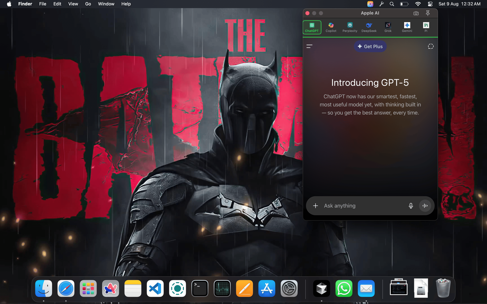
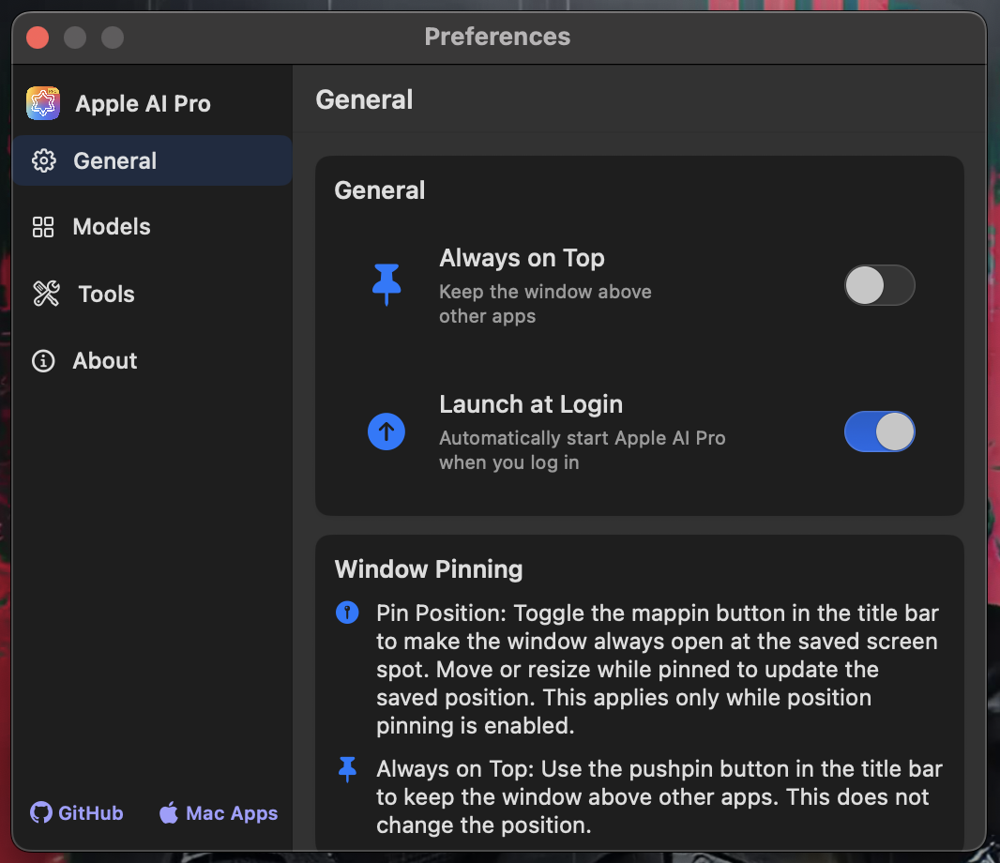
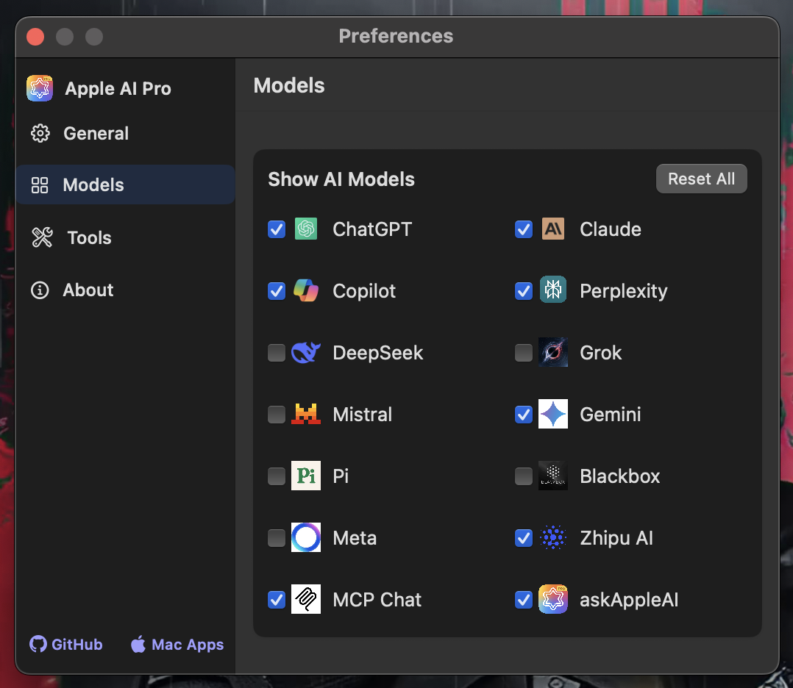
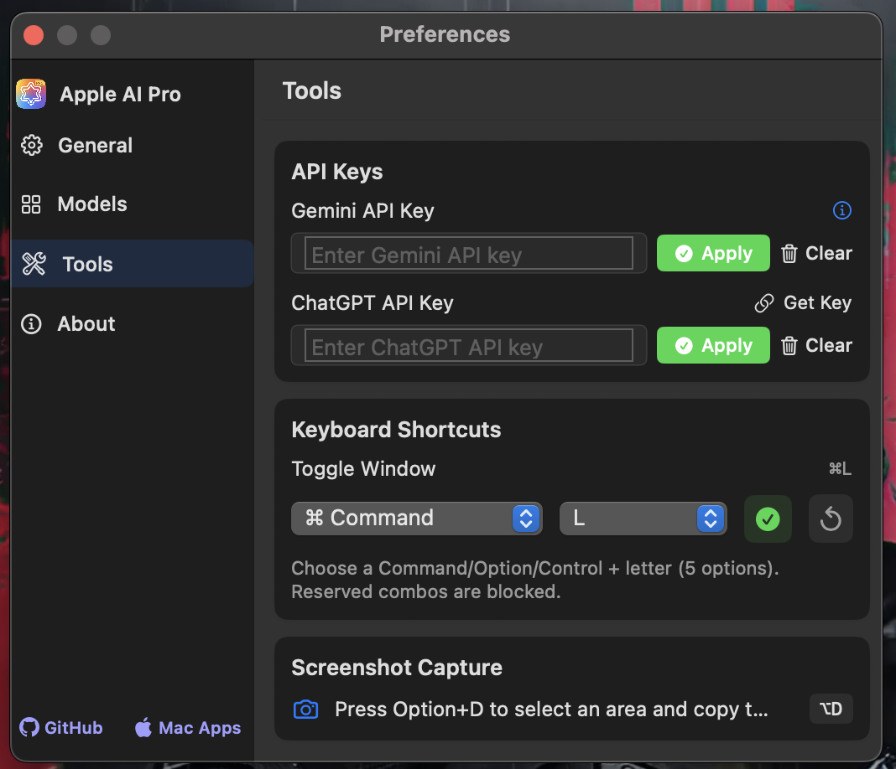
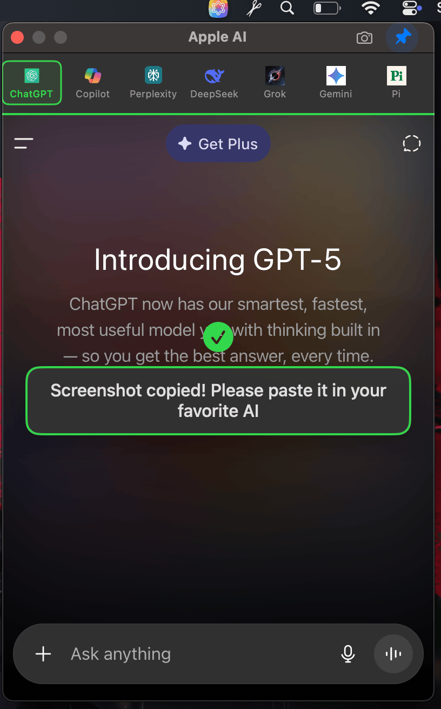
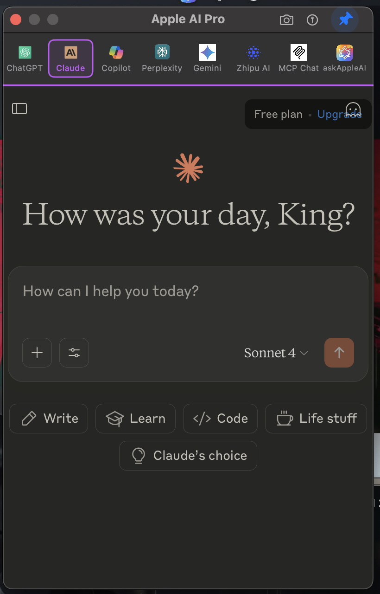
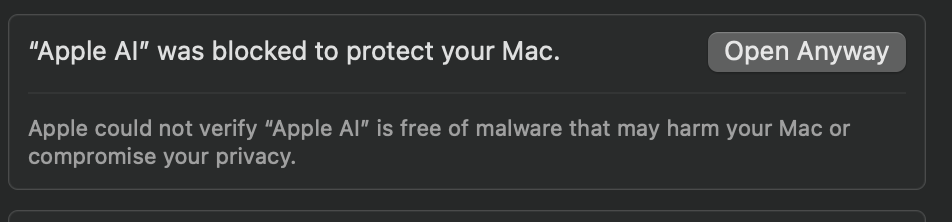

# Apple AI for macOS

Apple AI is a lightweight, privacy‑minded macOS menu bar app that keeps your favorite AI assistants one keystroke away. Open a compact, always‑on‑top chat window and jump between services like ChatGPT, Claude, Copilot, Perplexity, Gemini, and more — all from one place.

Now available as AppleAi Pro

  <a href="https://www.theappleai.tech/pricing" style="display:inline-block;background:#007aff;color:#fff;padding:10px 18px;border-radius:8px;text-decoration:none;font-weight:600;">
    🚀 Upgrade to AppleAi Pro — Pricing
  </a>

## Download
Choose either official site to get the latest DMG:
- [Download from MacBunny](https://macbunny.co/appleai)
- [Download from TheAppleAI](https://www.theappleai.tech)

## App Preview

  

## Video Demo

  
  
<em>Click to watch the demo video</em>

## Screenshots

  
  

  

  
 

## Features
- Menu bar access with a compact, distraction‑free chat window
- Quick model switching with icons for each service
- Global shortcut to toggle the window: ⌘E
- Always on Top mode to keep the chat visible while you work
- Pinnable interface so the window stays put while multitasking
- Instant access to all assistants from the menu bar
- Persistent sessions per assistant across app restarts
- Native macOS performance (Swift + SwiftUI, WKWebView)
- Resource‑efficient compared to multiple browser tabs
- Clean, modern UI that follows macOS design guidelines
- Customizable themes: light/dark with accent color options
- Smart history: search and reference past conversations
- Privacy‑focused: all preferences and data stored locally by default
- Full keyboard support: ⌘C, ⌘V, ⌘A work in all chat inputs
- Open at Login option for quick startup
- Simple, fast, and local — no auto‑updaters, no background daemons

## Supported services
- ChatGPT
- Claude
- Copilot
- Perplexity
- DeepSeek
- Grok
- Mistral
- Gemini
- Pi
- Blackbox
- Meta
- Zhipu AI
- MCP Chat
- askAppleAI (custom entry)

The visibility of individual services can be toggled in Preferences.

## Installation
1. Download the latest DMG `Apple_AI_Universal.dmg` from [MacBunny](https://macbunny.co/appleai)
2. Open the DMG and drag “Apple AI” to Applications.
3. Launch Apple AI. A star icon appears in the macOS menu bar.

Tip: If macOS warns that the app is from an unidentified developer, open System Settings → Privacy & Security and click "Open Anyway".

### First Launch Security
- When installing Apple AI, you may encounter a security warning due to macOS's Gatekeeper feature

- This is a normal security measure to ensure the app is from a trusted source
   

- If you see a security warning, go to System Settings > Privacy & Security and click 
"Open Anyway"

## Preferences
Open Preferences from the menu:
- Always on top: Keep the chat window above other apps.
- Open at Login: Start Apple AI automatically when you log in.
- Models: Show/hide the services you want in the quick menu.
- Keyboard Shortcuts: Toggle Window is fixed to ⌘E for reliability.
- About: Shows the app version and helpful links.

## Keyboard Shortcuts
- ⌘E: Toggle Apple AI window open/closed (works globally across apps)
- Standard text editing in chat inputs: ⌘C, ⌘V, ⌘A

## Privacy
- Apple AI runs entirely on your Mac. It opens each service’s official website in a WKWebView.
- Your chats and settings remain on your device. We do not collect your data.
- Microphone and screen access are only requested when you use features inside those web apps (e.g., voice chat or screenshot uploads).

## Compatibility
- macOS Monterey (12.0) and later
- Apple Silicon (M1/M2/M3) and Intel Macs
- Universal DMG recommended for best compatibility

## Troubleshooting
- “App is damaged and can’t be opened”: run `xattr -cr "/Applications/Apple AI.app"` or use System Settings → Privacy & Security → Open Anyway.
- Global shortcut not working: ensure no other app uses ⌘E globally.
- Chat not accepting input: click once inside the web view to focus, or toggle the window with ⌘E.

## License
This repository is provided for personal use. See source headers for details.

## Credits
- Designed and developed by MacBunny.
- Icons for services belong to their respective owners.

—
If you have suggestions or run into issues, open an issue on GitHub or reach out via the links in Preferences.

